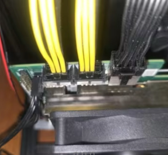
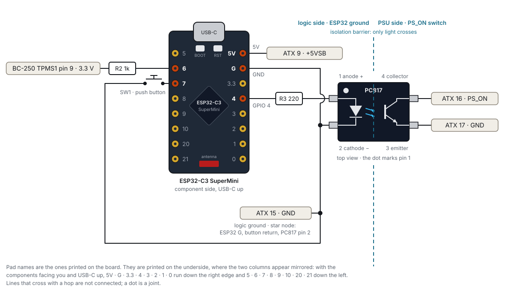
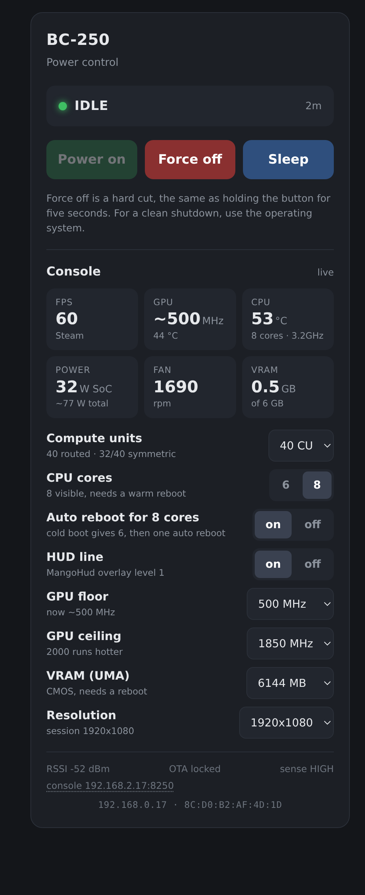

# lethe-bc250

<p align="center">
  
</p>

Notes, scripts, firmware and case files for turning an **AMD BC-250** mining board into a small
living-room gaming PC running **Bazzite** (SteamOS-like, Gaming Mode by default). Everything here is
what one particular build actually uses, so it favours "this works" over "every option". The repo is
self-contained: the tuning script, its Decky plugin, the ESP32 firmware and the case STLs are all in
here.

> **Status:** the build is complete and in daily use; the guide is still being polished.

## What this repo brings to the table

Three things you will not find in the base images, plus the build notes to put them together:

**1. Robust power management with an ESP32** ([§5](#5-soft-power-control-with-an-esp32)). Out of the
box the BC-250 has no power button and no way to switch itself off: it boots when the PSU comes up
and, after a shutdown, the PSU keeps running. A small optocoupler circuit on an ESP32-C3 fixes that:

* **Shut down like a normal computer.** Pick Shutdown in Steam or the desktop and the machine actually
  goes dark: the ESP32 sees the board halt and cuts the PSU to standby, under a watt.
* **A real power button.** One press on the front of the case starts it; hold five seconds to force
  it off.
* **Remote on/off over the web.** The ESP32 serves a small page on your LAN (and a REST API) to power
  the console on from the sofa or another room, and to hard-cut it if it ever hangs.
* **The console's stats and switches on the same page.** A tiny REST service on the BC-250
  (`bc250-api`, [§4.6](#46-stats-and-switches-over-the-network-bc250-api)) exposes what the HUD shows
  (FPS and game, GPU clock and temperature, CPU, SoC and total power, fan rpm, CU and core counts)
  and every `bc250-tune` switch. The ESP32 page polls it from the phone's browser every 5 s while
  the machine runs, so the ESP32 itself does no extra work.

**2. Tuning from the Steam menu, no custom BIOS: the BC-250 Tune Decky plugin**
([§4](#4-tuning-bc250-tune)). Everything the modded-BIOS crowd flashes for, done from Linux on the
stock firmware and switchable from the Quick Access menu without leaving Gaming Mode: VRAM/RAM split
(written to CMOS), GPU clock range, the 40 CU unlock, the 8-core unlock, output resolution, and a
one-line MangoHud HUD showing what is enabled. A boot service re-applies it all, and a Bazzite reinstall
does not lose the VRAM split.

**3. Pseudo sleep: the BC-250 Sleep Decky plugin** ([§4.5](#45-fake-sleep-the-bc-250-sleep-plugin)).
Real suspend and hibernation do not work on the BC-250 (the S3 path has not been reverse-engineered,
suspend-to-idle hangs, hibernation is buggy), and Steam's Sleep entry would hang the board. The plugin
gives you what you wanted from Sleep instead: it freezes the game, mutes, turns the TV off and wakes on
any controller or keyboard button exactly where you left off (not the case power button: the board
stays powered, fans and LEDs on, and a long press there cuts the power), and it takes over Steam's
Sleep entry so the real, board-hanging suspend can never be triggered.

Recommended companion from the Decky store: **Pause Games** (freeze and resume individual games with
SIGSTOP/SIGCONT, like the Steam Deck's quick suspend) for pausing one game while the console stays
awake, for example to hop into another game and come back. It is optional: BC-250 Sleep does its own
freezing and does not depend on it. It works on the BC-250 after the small permission fix in
[§4.1](#41-install).

For everything about the board itself (BIOS, pinouts, VRAM, power, kernel, governor), the
[AMD BC-250 community documentation](https://elektricm.github.io/amd-bc250-docs/) by elektricM is the
reference this guide leans on. Start there if something here is not covered.

**Contents**

0. [Quick start](#0-quick-start)
1. [Components](#1-components)
2. [Hardware preparation](#2-hardware-preparation) — heatsink lid, power cable
3. [Install Bazzite and the 62fixolab BC-250 image](#3-install-bazzite-and-the-62fixolab-bc-250-image)
4. [Tuning: `bc250-tune`](#4-tuning-bc250-tune) — VRAM split, clocks, 40 CU, 8 cores, HUD, resolution, Steam menu plugin, fake sleep plugin
5. [Soft power control with an ESP32](#5-soft-power-control-with-an-esp32) — circuit, flashing, OTA, web page
6. [3D-printed case](#6-3d-printed-case)
7. [Things we learned](#7-things-we-learned)
8. [Credits](#8-credits)

---

## 0. Quick start

The whole build, in order. Each step links to the section with the details.

1. **Parts** — get everything in [§1](#1-components). The EPS12V → 2× Micro-Fit power cable is not
   optional.
2. **Board prep** — take the lid off the heatsink and renew the paste and pads
   ([§2.1](#21-remove-the-heatsink-lid)), cut the tabs off the power plugs and fit the cable
   ([§2.2](#22-fit-the-power-cable-and-the-auto-power-on-jumper)). Set the AUTO_PWRON1 jumper to auto power-on, disable IOMMU and set the fan mode to
   Default or Customize, not Full Speed, in the BIOS ([§3.1](#31-before-the-os)).
3. **OS** — install stock Bazzite (deck), then rebase to the 62fixolab `-40cu` image and reboot
   ([§3](#3-install-bazzite-and-the-62fixolab-bc-250-image)).
4. **Tune** — clone this repo on the BC-250 and run `sudo ./bc250-tune install`; optionally add the
   Decky plugin for the Steam Quick Access menu ([§4](#4-tuning-bc250-tune)) and
   `sudo bc250-api/install.sh` for the stats and switches over the network ([§4.6](#46-stats-and-switches-over-the-network-bc250-api)).
   Set the Performance Overlay slider to level 1 for the HUD. Treat 40 CU and 8 cores as optional
   experiments: each board is a silicon lottery.
5. **Power button** — build the ESP32 optocoupler wiring, flash the firmware with the Arduino IDE, and
   test with the multimeter at each step ([§5](#5-soft-power-control-with-an-esp32)).
6. **Case** — print the STLs, fit the inserts, mount the two fans on the double shroud, assemble
   ([§6](#6-3d-printed-case)).
7. **Use** — Shutdown from Steam powers the PSU down by itself; press the button to start. Never use
   Sleep ([§7](#7-things-we-learned)).

---

## 1. Components

Everything used in this build, with the exact parts where it matters.

| Part | Notes |
|------|-------|
| **AMD BC-250 mining card** | Cyan Skillfish / Oberon APU: 6 of 8 Zen 2 cores and 24 of 40 RDNA2 CUs enabled from the factory, 16 GB GDDR6 shared between CPU and GPU. Stock ASRock BIOS P3.00. Needs an NVMe SSD (M.2 2280) for the OS. |
| **PSU: Metalfish 500 W, Flex ATX** | [AliExpress](https://es.aliexpress.com/item/1005009609601844.html). **Flex ATX** form factor, which is what the printed case's PSU compartment is sized for (§6); a standard ATX or SFX unit will not fit. Standard ATX pinout otherwise: 24-pin and an EPS12V 8-pin for the board cable. The BC-250 draws ~125–180 W at the extremes, all from the 12 V rail. |
| **Power cable: 8-pin EPS12V → 2× Micro-Fit 8-pin** — **REQUIRED, fire safety** | [moddiy ASRock BC-250 cable](https://www.moddiy.com/products/6837/Standard-8-Pin-EPS12V-to-2-x-MicroFit-8-Pin-Cable-for-ASRock-BC250.html). The board has two Micro-Fit 8-pin power inputs. Feeding it through a single PCIe 8-pin plug forces the whole 200–250 W peak draw down one 18 AWG lead set, which is beyond what that gauge is rated for and heats the cable and connector. This adapter takes the PSU's EPS12V (CPU) 8-pin, whose four 12 V conductors are rated for it, and splits it across both board inputs. Do not run the board on a PCIe cable alone. The plugs' tabs must be cut for them to seat; see [§2.2](#22-fit-the-power-cable-and-the-auto-power-on-jumper). |
| **Soft power control** | **ESP32-C3 SuperMini** (recommended: tiny, USB-C, runs happily from the PSU's 5 V standby rail; any ESP32 works), [16 mm momentary push button](https://www.amazon.es/dp/B07Z4PHKJX), PC817 optocoupler, resistors (220 Ω and 1 kΩ), hookup wire, solder, heatshrink tube. Full parts list and build in [§5](#5-soft-power-control-with-an-esp32). |
| **Cooling** | 2× **ARCTIC P12 Pro PST** 120 mm fans on the double fan shroud (recommended over a single fan). Daisy-chain the second from the first one's PST pass-through, so both hang off the board's one 4-pin header and both get its PWM signal; that is what lets the Sleep plugin slow them down (§4.5). More airflow and static pressure than the plain P12, and they go down to ~500 rpm at low duty. **Thermalright TFX** thermal paste for the APU (a full tube's worth is not excessive: the die sits ~1 mm below the heatsink base, §2.1) and new **2 mm thermal pads** for the GDDR6 and VRMs; the factory ones are dry. |
| **Case** (optional) | Access to a 3D printer for the case in [§6](#6-3d-printed-case), plus 12× [M3 heat-set inserts](https://es.aliexpress.com/item/1005005920120561.html) and 12× [M3 × 6 mm screws](https://es.aliexpress.com/item/1005008082257314.html). |

Tools: a fine-tipped soldering iron, side cutters, wire strippers, a multimeter (not optional for the
power circuit), thin sharp scissors for the heatsink lid, a crimping tool for the Molex terminals, and a hot-glue gun for
fixing the taps.

---

## 2. Hardware preparation

### 2.1 Remove the heatsink lid

The stock BC-250 cooler is a tall fin stack with a thin metal lid folded over the top of the fins.
It was made for the mining chassis, where fans push air front-to-back through the fins like a duct.
In the printed case the 120 mm fans sit on the shroud and blow onto the fins, and the lid is in the
way, so it comes off.

<p align="center">
  
</p>

* Work with the heatsink off the board so you are not pressing on the APU.
* Use **thin, sharp scissors**. Cut the lid along the fin tops a few fins at a time, then peel the
  strip away, as in the photo. It is only crimped over the fins; there is no adhesive.
* **Protect your thumb.** The lid is thin sheet metal and the scissor handle bites into the thumb
  over a few hundred fins; without a glove or a piece of tape over the thumb it will go numb for days.
  The cut edges are sharp too.
* Go slowly. The fins bend easily; straighten any you fold with a flat blade afterwards.
* Shake and blow out the swarf before refitting the heatsink.
* **Renew the thermal interface while the heatsink is off.** The factory paste on the APU and the pads
  on the GDDR6 and VRMs are dry after years in a mining rack. Clean the APU and heatsink with
  isopropyl alcohol, apply new paste, and replace every pad with new **2 mm** pads (measure the old
  ones to confirm they match before you buy; do not reuse them).
* **Paste: Thermalright TFX, applied generously.** There is about a **1 mm gap** between the APU die
  and the heatsink base, far more than a normal CPU mount, so a thin rice-grain layer would not bridge
  it and the die would run hot. Spread a thick, full-coverage layer; a high-viscosity paste like TFX
  holds that thickness without pumping out. Do not rely on the pads to set the gap.

### 2.2 Fit the power cable and the auto power-on jumper

While the board is out, set the **AUTO_PWRON1** jumper to pins 1–2 (auto power-on) so the board boots
whenever the PSU comes up; see §3.1.

> [!CAUTION]
> **Fire hazard. Use the EPS12V → 2× Micro-Fit cable from §1; this is not optional.**
> The BC-250 has two Micro-Fit 8-pin power inputs. Feeding the board through a single PCIe 8-pin plug
> puts its entire draw through one set of 18 AWG wires. With the tuning in §4 enabled (40 CU, 8 cores,
> higher GPU clock) that draw peaks at **200–250 W**, beyond what 18 AWG is rated for, and the wire and
> connector heat up. The EPS12V (CPU) 8-pin has four 12 V conductors rated for it; the adapter splits
> them across both board inputs. Never run the board on a PCIe cable alone, and never enable the
> unlocks on one.

Fitting it: the plugs' retention tabs foul the board, so **cut the tabs off** the two Micro-Fit
plugs before they will seat. Orientation as in the photo, both plugs side by side on the board's edge
connectors with the wires leaving upward.

<p align="center">
  
</p>

---

## 3. Install Bazzite and the 62fixolab BC-250 image

The BC-250 has no power button header, so read the whole section before starting.

### 3.1 Before the OS

* **BIOS.** This build runs the **stock ASRock P3.00 BIOS**. The 62fixolab images recommend a modded
  BIOS with "512 MB dynamic VRAM" and IOMMU disabled; the VRAM split is instead set from Linux with
  `bc250memcfg` (§4), which works on the stock BIOS. **IOMMU must be disabled** in BIOS.
* **BIOS fan mode: not Full Speed.** The BIOS offers *Default*, *Full Speed* and *Customize* for the
  fan header. In **Full Speed** the embedded controller pins the header at 100 % and ignores every
  PWM write from Linux, so the Sleep plugin's *Quiet the fans* option (§4.5) can never slow the
  fans (its guard notices the rpm not dropping and gives the header back). Set **Default** or
  **Customize**; both leave the board's own curve in charge until the plugin takes the header for a
  fake sleep. The fans on this board run at a near-constant ~1570 rpm on the stock curve anyway,
  idle or loaded, so Full Speed buys nothing.
* **Auto power-on jumper.** Set the board's **AUTO_PWRON1** jumper to the auto-power-on position
  (pins 1–2). The BC-250 then boots by itself as soon as 12 V appears, which is what both the ESP32
  circuit (§5) and a plain PS_ON switch rely on; there is no power button header to press otherwise.
* **Power switch.** Without the ESP32 circuit in §5, put a latching switch on the ATX PS_ON pin
  (green wire, pin 16, to ground) or jumper it permanently.
* **Boot media.** A USB stick with the Bazzite installer and a keyboard.
* **No sleep.** Neither suspend (S3 is not reverse-engineered yet; suspend-to-idle hangs) nor
  hibernation works on the BC-250; always shut down (§7).

### 3.2 Install stock Bazzite (deck variant)

1. Download the Bazzite ISO from <https://bazzite.gg> — choose **AMD**, and the **Steam Deck /
   handheld (Gaming Mode) desktop**. The deck variant boots straight into Steam's Gaming Mode.
2. Write it to a USB stick, boot the BC-250 from it and install to the NVMe.
3. First boot: finish the Steam setup, then switch to **Desktop Mode** (Power menu → Switch to Desktop)
   and open a terminal for the next steps.

### 3.3 Rebase to the 62fixolab patched image (40 CU experimental variant)

The [62fixolab images](https://github.com/62fixolab/Latest-Bazzite-AMD-BC-250-Patched-Images) are
stock Bazzite plus the BC-250 kernel patches, the `cyan-skillfish-governor-smu` GPU governor, and, in
the `-40cu` variant, `umr`, `bc250-cu-live-manager` and the `ujust bc250-cu-*` helpers. Nothing is
enabled automatically at first boot (40 CU is off).

```bash
# deck variant with the 40 CU tooling (what this build uses)
rpm-ostree rebase ostree-image-signed:docker://ghcr.io/62fixolab/bazzite-bc250-patched-deck-40cu:latest
systemctl reboot
```

Other variants: replace `deck` with `gnome` or `kde`; drop `-40cu` for the plain image. Update channels
are `:latest` (stable, recommended), `-testing:latest` and `-unstable:latest`, e.g.
`…/bazzite-bc250-patched-deck-40cu-testing:latest`. Do not rebase between desktop environments.

### 3.4 Verify

```bash
rpm-ostree status                                        # shows the 62fixolab image
systemctl status cyan-skillfish-governor-smu --no-pager  # active
for f in /sys/class/drm/card*/device/pp_dpm_sclk; do echo "$f"; cat "$f"; done
```

Updates from then on: `ujust update`. Rollback: `rpm-ostree rollback && systemctl reboot`.

---

## 4. Tuning: `bc250-tune`

All the tuning lives in one script, [`decky-bc250-tune/bc250-tune`](decky-bc250-tune/bc250-tune), with a
**Decky Loader plugin** ([`decky-bc250-tune/decky-plugin/`](decky-bc250-tune/decky-plugin/)) that puts the same
switches into Steam's Quick Access menu (the `…` button) so nothing needs Desktop Mode. The folder has
its own [README](decky-bc250-tune/README.md) with every option; this is the summary.

<p align="center">
  
</p>

Photographed on the TV with 40 CU and 8 cores switched on: the GPU clock shows `~500 MHz` (estimated
from voltage, see §4.2), 8 cores at 51 °C, 35 W package power, 6144 MB VRAM at 1920x1080.

> [!CAUTION]
> `CU=40`, `CORES=8` and `GPU_MAX=2000` raise the board's draw to 200–250 W peaks. Only enable them
> with the EPS12V → 2× Micro-Fit power cable fitted (§2.2). On a single PCIe 8-pin cable this is a
> fire hazard.

> [!WARNING]
> **Silicon lottery.** The 40 CU and 8-core unlocks re-enable hardware that AMD disabled at the
> factory, and not every board has healthy spare units. Some BC-250s run all 40 CUs and 8 cores for
> years, others artifact, crash or fail to launch games at 40 CU, or hang after the core unlock. Nothing
> in this guide can predict which you have. Enable one unlock at a time, test with demanding games and a
> stress run while watching temperatures in the HUD, and only keep what stays stable. If 40 CUs
> misbehave, step down (`CU=36`, `32`, …) until it is stable rather than giving up on the unlock. Both unlocks
> revert easily: `CU=24` is live, and a cold boot (power off) restores 6 cores.

| Switch | What it does | Applies |
|--------|--------------|---------|
| `UMA_SIZE` | VRAM / system-RAM split of the 16 GB, written to CMOS with [bc250memcfg](https://github.com/fanoush/bc250_memcfg) (built from source at install). Survives reinstalls; only a CMOS clear resets it. | next reboot |
| `GPU_MIN` / `GPU_MAX` | The governor's frequency range. 500 MHz floor saves ~10 W at idle; 1850 MHz is the image default ceiling. | live |
| `CU` 24 … 40 | Routes WGPs (two CUs each) through `bc250-cu-live-manager`, any even count from the stock 24 to all 40. Extra WGPs go on one shader row at a time, so 32 and 40 are symmetric and the other steps leave the rows one WGP apart: a ladder for finding what a board tolerates. At 40: compute ~1.6x, games only a few % (fill-rate bound), ~+30 W. | live, re-applied at boot |
| `CORES` 6 / 8 | Enables the two dormant cores with an SMU message (technique from [GabriWar/bc250-core-cu-unlock](https://github.com/GabriWar/bc250-core-cu-unlock)). Nothing is flashed. | warm reboot; a cold boot reverts |
| `CORES_AUTO_REBOOT` | The core mask does not survive a power-off, so a cold boot with `CORES=8` comes up with 6 cores until a warm reboot. `on` makes the boot service do that reboot itself, once (a persistent stamp rules out a loop). Adds ~40 s to a power-on. | next cold boot |
| `HUD` | One-line MangoHud layout as Performance Overlay level 1 (files in [`decky-bc250-tune/mangohud/`](decky-bc250-tune/mangohud/)) | next game launch |
| `RES` | Gaming Mode output resolution (e.g. 1080p on a 4K panel) | gaming session restart |

### 4.1 Install

On the BC-250, from a Desktop Mode terminal:

```bash
git clone https://github.com/lethevimlet/lethe-bc250.git
cd lethe-bc250/decky-bc250-tune
sudo ./bc250-tune install          # installs to /usr/local/bin, builds bc250memcfg, enables bc250-tune.service, applies defaults
sudo bc250-tune status
```

Decky plugin (optional, for the Quick Access menu; the frontend is prebuilt in `decky-plugin/dist/`):

```bash
ujust setup-decky install
sudo mkdir -p ~/homebrew/plugins/bc250-tune
sudo cp -r decky-plugin/{plugin.json,package.json,main.py,LICENSE,dist} ~/homebrew/plugins/bc250-tune/
sudo chown -R root:root ~/homebrew/plugins/bc250-tune
sudo systemctl restart plugin_loader      # then restart Steam / the gaming session
```

Open the Quick Access menu → Decky (plug icon) → **BC-250 Tune**. Set the Performance Overlay slider to
level 1 to get the HUD line.

Two Decky notes for Bazzite: the `ujust` installer leaves Decky's own binary readable by root only,
which breaks every plugin that does not run as root (the backend dies with `PermissionError:
…/homebrew/services/PluginLoader`); fix it once with
`sudo chmod a+rx ~/homebrew/services ~/homebrew/services/PluginLoader && sudo systemctl restart plugin_loader`.
And the store's **Pause Games** plugin (freeze and resume a running game with SIGSTOP/SIGCONT, like
the Steam Deck's quick suspend) works on the BC-250 once that is done; it is a nice companion since real
sleep is not available.

### 4.2 What this build runs

| Setting | Value | Why |
|---------|-------|-----|
| VRAM split | 6144 MB VRAM / ~9.6 GB RAM | 1080p never needs 8 GB of VRAM; the RAM is more useful |
| GPU range | 500–1850 MHz | 1850 is the image default; 500 idle floor drops idle package power from ~41 W to ~32 W |
| Resolution | 1920x1080 | The GPU is roughly RX 6600 class; 4K is not realistic |
| CU / cores | toggled from the plugin as needed | 40 CU + 8 cores are worth ~5–12 % in games for ~50 W more; this particular board is stable with both, yours may not be |
| HUD | on, overlay level 1 | `· 60 FPS \| GPU 48°C 1300MHz  CPU 54°C  SoC 47W  TOTAL ~92W  FAN 1587  24CU 6C` |

The HUD's `SoC` is the measured APU package power; `TOTAL ~` adds ~45 W for the GDDR6, VRM losses,
fan and SSD because the board has no 12 V sensor. `24CU 6C` shows what is currently enabled. With
8 cores enabled the kernel's GPU clock readouts break, so the clock is estimated from the GFX voltage
and shown with a `~`.

### 4.3 Commands

```bash
sudo bc250-tune menu                 # whiptail TUI
sudo bc250-tune set cu 40            # keys: uma gpu-min gpu-max cu cores hud res
sudo bc250-tune set cores 8          # then: sudo bc250-tune reboot   (warm)
sudo bc250-tune status --json
```

### 4.4 The custom HUD line

One line, top of the screen, nothing else on it:

```
· 47 FPS | GPU 48°C 1300MHz  CPU 54°C  SoC 47W  TOTAL ~92W  FAN 1587  24CU 6C
```

| Field | Source | Meaning |
|-------|--------|---------|
| `47 FPS` | MangoHud | frame rate; the `·` replaces the engine name MangoHud would print |
| `GPU 48°C 1300MHz` | amdgpu edge temperature; governor clock | with 8 cores enabled the kernel clock readouts are garbage, so the clock is estimated from the GFX voltage and shown as `~1300MHz` |
| `CPU 54°C` | k10temp Tctl | CPU temperature |
| `SoC 47W` | amdgpu package power (PPT) | the real, measured number: CPU cores + GPU + memory controller |
| `TOTAL ~92W` | `SoC + 45 W` | estimate of what the power cable delivers; the board has no 12 V sensor. Offset is `TOTAL_OFFSET_W` in `/etc/bc250-tune/config` |
| `FAN 1587` | board fan header (nct6686) | fan speed, rpm (both fans on the Y-splitter report as one) |
| `24CU 6C` | `bc250-tune` state | compute units routed and CPU cores enabled |

Everything after the FPS comes from `bc250-tune hud-stats`, which MangoHud runs through its `exec=`
option. MangoHud's own `cpu_power` and `gpu_power` are not used: on the BC-250 the first does not
initialise and the second reports only the graphics block, not the package.

**Enabling it.** `bc250-tune` with `HUD=on` (the default) writes two files for the desktop user:

* `~/.config/MangoHud/presets.conf` — defines `[preset 1]`. In Gaming Mode Steam ignores
  `MangoHud.conf` and picks a preset from the **Performance Overlay Level** slider in the Quick Access
  menu (the `…` button → performance tab). **Level 1 is our line**; levels 2–4 stay MangoHud's built-ins.
  Read at game launch.
* `~/.config/MangoHud/MangoHud.conf` — the same line for Desktop Mode or games launched with
  `mangohud %command%`. Toggle with `Right Shift + F12`.

Both files are marked `# bc250-tune managed`; the script never overwrites an unmarked `MangoHud.conf`
of your own, and `HUD=off` removes only its own files. Reference copies are in
[`decky-bc250-tune/mangohud/`](decky-bc250-tune/mangohud/).

**Why the config looks odd.** With MangoHud 0.8 (`legacy_layout=0`) every option listed in the file
becomes a column with a `|` separator, even ones set to `0`, which is where stray empty bars come
from. So the preset lists only `fps` and `exec`, sets `fps_text=·` to drop the engine name, and puts
`frametime=0` last, where it hides the ms value without adding a column. One `|` between the FPS and
the rest is unavoidable. To change the line, edit the `printf` in `hud_stats()` in the script; to
preview layouts without a game, run `mangohud glxgears` under `Xvfb` and screenshot it.

### 4.5 Fake sleep: the BC-250 Sleep plugin

The board cannot sleep, and Steam's **Sleep** entry hangs it (logind suspend → suspend-to-idle → never
wakes; only a power cut recovers). [`decky-bc250-sleep/`](decky-bc250-sleep/) is a second Decky
plugin that gives you the thing you actually wanted from Sleep, a quick pause-and-resume, and makes the
real Sleep harmless:

| Step | What happens |
|------|--------------|
| Sleep | the running game's whole process tree is frozen (`SIGSTOP`, nothing rendered, GPU drops to its idle clock), audio is muted, and the TV is put to sleep through gamescope (`drm_sleep_external_screen`, real DPMS off) |
| While asleep | the board stays fully powered at its idle package power (~32 W SoC, ~75 W at the wall): the **board LEDs stay lit** and only the TV is dark. The board's own fan curve barely slows down when the chip idles, so the plugin drops the **fan header to a low duty** itself (through the nct6687 driver; 15 % by default, about 770 rpm on the P12 Pro, adjustable in the plugin) and gives it back on wake, or at once if a die passes 65 °C, the fan stalls or does not respond (BIOS fan mode *Full Speed* ignores it; use *Default* or *Customize*). It is a pause, not a power saving |
| Wake | the first button press on any controller, keyboard or mouse turns the TV back on, thaws the game and unmutes; you are back exactly where you left off. **Do not use the case power button to wake:** the ESP32 sees the board as running, so a short press does nothing and a five-second hold hard-cuts the power (§5) |

How to trigger it:

* **Steam's own Sleep entry** in the power menu (on by default, option *Use Steam's Sleep button*).
  The plugin replaces the `SuspendPC` call Steam makes and, as a safety net, masks the systemd sleep
  units so logind refuses any suspend request ("Unit suspend.target is masked, refusing operation")
  instead of hanging the board. Verified on this build: Steam's Sleep runs the fake sleep, nothing
  reaches logind, and Sleep stays listed in the power menu with the units masked. If Decky ever fails
  to inject on a boot, the menu's Sleep falls through to the masked units and simply does nothing,
  which is still harmless. **Leave the option on:** switching it off removes both the replacement and
  the mask, and Steam's Sleep becomes the real, board-hanging suspend again.
  Steam plays its own suspend animation and goes black before it calls the OS, and it only comes back
  on the resume event a real suspend would produce; on wake the plugin raises that event itself
  (`SuspendResumeStore.OnResumeFromSuspend`), so the home screen returns instead of staying black.
* The **Sleep now** button in the plugin's own panel (Quick Access → Decky → BC-250 Sleep).

Install like the tuning plugin (it is prebuilt):

```bash
cd lethe-bc250/decky-bc250-sleep
sudo mkdir -p ~/homebrew/plugins/bc250-sleep
sudo cp -r plugin.json package.json main.py LICENSE dist ~/homebrew/plugins/bc250-sleep/
sudo chown -R root:root ~/homebrew/plugins/bc250-sleep
sudo systemctl restart plugin_loader
```

Notes: it runs as root (it reads `/dev/input` and signals the game's processes). The game is found by
Steam's launcher shape (`reaper SteamLaunch AppId=N`), so only Steam-launched games are frozen; the
Steam UI itself keeps running, which is what makes the wake button work. Some games dislike being
frozen for very long (network sessions time out, anti-cheat may complain), same as with the store's
Pause Games plugin. The freezing is built in; Pause Games is not required. If Decky is ever restarted or the plugin reloaded while asleep, it wakes everything
first so nothing stays frozen. The HDMI audio sink disappears while the TV is asleep, so the unmute is
retried for a moment after wake.

---

### 4.6 Stats and switches over the network: `bc250-api`

[`bc250-api/`](bc250-api/) is a one-file REST service (Python, standard library only) that runs as a
systemd unit on the BC-250 and answers on port 8250:

```
GET  /api/status                 fps + game, GPU MHz/°C, CPU °C/MHz/cores, SoC and ~total W, fan rpm, VRAM, RAM, asleep, tune
GET  /api/tune[?refresh=1]       bc250-tune status --json (cached 30 s)
POST /api/tune/set               {"key":"cu","value":"40"}  → bc250-tune set cu 40
POST /api/tune/reboot            warm reboot (8 cores)
POST /api/tune/restart-session   gaming session restart (resolution)
POST /api/sleep, /api/wake       fake sleep / wake (through the BC-250 Sleep plugin's control socket)
```

```bash
sudo bc250-api/install.sh                       # on the BC-250
curl http://<console-ip>:8250/api/status         # from anywhere on the LAN
```

FPS and the focused game come from gamescope's own stats pipe, which SteamOS creates and nothing
reads (a line every 300 composited frames, so `fps` is `null` while the Steam UI sits idle). The
rest is the same sysfs the HUD line reads, sampled once a second in a background thread, so a
request answers in milliseconds. The ESP32 page uses it for its **Console** panel (§5.9); anything
else on the LAN can too. There is no authentication, like the ESP32's own power API: keep port 8250
on the trusted LAN. Details in [bc250-api/README.md](bc250-api/README.md).

## 5. Soft power control with an ESP32

Turns a standard ATX PSU on from a button or over the network, and off again by itself when the
BC-250 halts. Replaces the green-wire jumper, so the PSU sits under a watt when the machine is off
instead of running continuously.

Firmware: [`esp32-power-control/bc250_power_opto.ino`](esp32-power-control/bc250_power_opto.ino).

<p align="center">
  
</p>

### 5.1 How it works

* The ESP32 runs from the PSU's **+5 V standby** rail, so it stays awake with the main rails dead.
  That is what lets it switch the PSU back on.
* A button press lights the optocoupler's LED. The phototransistor on the other side pulls **PS_ON**
  to ground, the PSU starts, and the BC-250 auto-boots.
* **TPMS1 pin 9** on the BC-250 carries 3.3 V only while the board is powered. The ESP32 watches it
  through one series resistor, using its internal pulldown.
* On software shutdown that 3.3 V disappears, the ESP32 releases PS_ON, and the PSU returns to standby.

The optocoupler keeps the two halves electrically separate: its input is an LED and its output a
phototransistor, with no conductive path between them. The ESP32's ground and the PSU's switching
ground never meet inside the circuit, so the only way PS_ON can reach ground is by the LED being lit.

Detailed parts for this circuit:

| Part | Qty | Notes |
|------|-----|-------|
| ESP32-C3 SuperMini | 1 | Recommended. Any ESP32 works; check your silkscreen pin names |
| PC817 optocoupler | 1 | 4N35 also works. A dot marks pin 1 |
| 220 Ω resistor | 1 | R3, sets the LED current. 150–470 Ω all fine |
| 1 kΩ resistor | 1 | R2, sense series. Not 100 k, see the design notes |
| Momentary push button | 1 | Normally open. This build: [Gebildet 16 mm stainless momentary button with white LED ring](https://www.amazon.es/dp/B07Z4PHKJX), 1NO1NC, comes with a plug lead. Only the NO contact pair is used; the LED ring is optional (it needs its own supply) |
| ATX 24-pin taps | 4 | This build: four **female Molex-style crimp terminals** (the same pin type the 24-pin uses) pushed onto the PSU plug's pins 9, 15, 16 and 17 from the wire-entry side and fixed with **hot glue**. A male + female passthrough extension works too |
| Hookup wire | — | 24–26 AWG |
| Heatshrink | — | Two short sleeves for the two capsules |

Everything here is low voltage, but you are working next to a PSU. Unplug it from the wall before
touching connectors, and never open the PSU case: the primary side holds a lethal charge long after
it is unplugged.

### 5.2 ATX 24-pin pins used

<p align="center">
  
</p>

Contact face, retention tab on the right. The empty pin 20 and the tab between 18 and 19 fix the
orientation. Four pins are tapped:

| Pin | Signal | Used for |
|-----|--------|----------|
| 9 | +5VSB | ESP32 5V (live in standby) |
| 15 | GND | logic ground |
| 16 | PS_ON | optocoupler collector |
| 17 | GND | optocoupler emitter |

Pin 4 is not a substitute for pin 9: it carries +5 V only once the PSU has started, so an ESP32 fed
from it could never switch the PSU on. Only pin 9 is live in standby.

**How the taps are made in this build.** No connector was cut. Each of the four leads ends in a female
Molex-style crimp terminal, the same type that sits inside the 24-pin housing, crimped (or soldered) to
the wire. The terminal is pushed over the corresponding pin at the back of the PSU's 24-pin plug, where
the pins protrude from the wire-entry face, and a blob of **hot glue** holds it there and keeps it from
touching its neighbours. Check with the meter that each tap reads the expected rail and that none
bridges an adjacent pin before plugging the connector into the board. Hot glue peels off cleanly if you
ever need to undo it.

### 5.3 Connections

| From | To | Via |
|------|----|-----|
| ATX pin 9 · +5VSB | ESP32 5V | — |
| ATX pin 15 · GND | Logic ground node | — |
| ESP32 GPIO 4 | PC817 pin 1 · anode | R3, 220 Ω |
| PC817 pin 2 · cathode | Logic ground node | — |
| PC817 pin 4 · collector | ATX pin 16 · PS_ON | — |
| PC817 pin 3 · emitter | ATX pin 17 · GND | — |
| BC-250 TPMS1 pin 9 | ESP32 GPIO 6 | R2, 1 kΩ |
| ESP32 GPIO 7 | Logic ground node | Push button |

The logic ground node is a star: the ESP32 GND pad, the button return and PC817 pin 2 meet at one
joint, and a single wire runs from that joint to ATX pin 15. The power cable to the BC-250 is not
touched.

In the schematic, GPIO 4 high lights the LED, the phototransistor conducts, PS_ON is pulled to ground
and the PSU starts. Nothing crosses the dashed isolation barrier except light. Pins 15 and 17 are both ground and join
inside the PSU; run two wires so they join there, through the supply's own heavy conductors, and not
through your thin wires. Bridging PC817 pin 2 to pin 3 works electrically and throws that away.

### 5.4 Identifying the PC817

The dot marks pin 1. Pin 2 sits below it on the same side; pin 3 faces pin 2 across the body, and
pin 4 faces pin 1. Confirm with a meter in diode mode before soldering:

* One pair reads roughly 1000–1200 mV one way and open the other. That pair is the LED; the pin where
  the red probe sits for the conducting direction is pin 1.
* The remaining pair reads open both ways, in both directions. No body diode is exactly the property
  that makes this part the right choice for switching PS_ON.

### 5.5 The two capsules

There is no circuit board. Both small assemblies live inside heatshrink along the wiring, and everything
else is bare wire soldered to the ESP32's castellated pads.

* **Capsule 1**: the PC817 with R3 in series with pin 1. Four wires leave it: GPIO 4 in, ground out,
  PS_ON out, and the emitter ground out.
* **Capsule 2**: R2 inline, heatshrunk. Two wires out: one to TPMS1 pin 9, one to GPIO 6.

Slide the heatshrink onto the wire before soldering. Keep the leads short and use little solder: the
PC817's pins are close together and a generous joint bridges them easily.

### 5.6 Build order

| # | Step |
|---|------|
| 1 | Unplug the PSU at the wall. Prepare the four taps for pins 9, 15, 16 and 17 (female Molex terminals + hot glue, see §5.2). |
| 2 | Build capsule 1. Verify the LED with the diode test above, and confirm pins 3 and 4 read open in both directions. |
| 3 | Wire pin 9 to the ESP32 5V pad and pin 15 to the logic ground node. Plug in the PSU and confirm the ESP32 comes up with the system off. Measure the 5V pad against the ESP32's own GND pad; the onboard LED alone proves nothing. |
| 4 | Flash the firmware (§5.7) with `BENCH_MODE 0`. The serial log should show the boot line and state OFF. |
| 5 | Connect pin 16 to the collector and pin 17 to the emitter. Attach the power cable to the BC-250 and set AUTO_PWRON1 to pins 1–2. Press the button; the PSU should start and the board boot. |
| 6 | With the system running, measure TPMS1 pin 9 against ground. It should read 3.3 V and drop to 0 V after shutdown. Only then wire R2 to GPIO 6. |
| 7 | With the system on, measure PS_ON to ground. It must sit below 0.8 V. |

### 5.7 Flashing the firmware with the Arduino IDE

1. **Install the ESP32 core.** Arduino IDE 2.x → File → Preferences → *Additional boards manager
   URLs*: `https://espressif.github.io/arduino-esp32/package_esp32_index.json`. Then Tools → Board →
   Boards Manager, search `esp32`, install **esp32 by Espressif Systems**. No other libraries are
   needed: WiFi, WebServer, ESPmDNS and ArduinoOTA ship with the core.
2. **Board.** Tools → Board → ESP32 Arduino → **ESP32C3 Dev Module**.
3. **Enable the serial monitor.** Tools → **USB CDC On Boot → Enabled**. This routes the serial console
   over the USB-C connector. Without it the sketch runs normally but the serial monitor stays blank
   and you lose half the diagnostics. The setting is compiled into the binary, so if you change it you
   must recompile and re-upload; reopening the monitor is not enough.
4. **Configure the sketch.** Open `esp32-power-control/bc250_power_opto.ino` and set:
   * `WIFI_SSID` / `WIFI_PASS` — WPA2 needs an 8–63 character passphrase; leave `WIFI_PASS` as `""`
     for an open network.
   * `OTA_PASS` — **never leave it empty**; this firmware owns the machine's power path.
   * `MDNS_NAME` — the mDNS name (`bc250` → `http://bc250.local`). Treat it as a bonus: many home
     routers and phones do not resolve `.local`, so the reliable address is the ESP32's IP, fixed with a
     DHCP reservation (below).
   * `CONSOLE_API` — default `http://<console-ip>:8250` where `bc250-api` runs ([§4.6](#46-stats-and-switches-over-the-network-bc250-api)).
     It can be changed later from the page footer (kept in the ESP32's NVS), so a new console IP
     needs no reflash. `""` hides the Console panel.
   * `BENCH_MODE` — `1` for bench testing (see below), `0` for normal use.
5. **Disconnect the +5VSB wire before plugging in USB.** Most SuperMini clones tie USB VBUS straight to
   the 5V pin with no blocking diode, so leaving it connected ties the PSU standby rail to your
   computer's USB port.
6. **Connect and select the port.** Plug the ESP32 in with a data-capable USB-C cable and pick the new
   port under Tools → Port (`/dev/ttyACM*` on Linux, `COMx` on Windows). If no port appears, hold the
   board's **BOOT** button while plugging it in to force download mode, then try again.
7. **Upload.** Sketch → Upload. Then Tools → Serial Monitor at **115200 baud**. If the monitor is empty,
   press the board's **RESET** button with the monitor already open; USB CDC takes a moment to enumerate
   and the monitor sometimes attaches after the first lines have gone out. Expected:
   ```
   [wifi] MAC xx:xx:xx:xx:xx:xx  <- reserve this one on the router
   [wifi] connecting to <ssid>
   [web] server up on port 80
   [boot] BC250 power controller ready
   [state] OFF
   ```
8. **Bench mode.** With `BENCH_MODE 1` the state machine is held back and you drive the output from the
   serial monitor: `g` on, `l` off, `t` toggle, `?` status. Use it for steps 3–4 of the build order,
   then set it back to `0` and re-upload.

The MAC address printed at boot (also shown on the web page and in `/rest/status`) lets you reserve a
fixed IP on the router.

### 5.8 Updating the firmware over the air (OTA)

After the first USB flash, later versions can be sent over Wi-Fi. **The console must be powered
off first.** OTA only arms while the firmware is in the `OFF` state, on purpose: an update reboots the
ESP32, the optocoupler LED goes dark before any code runs, and a running BC-250 would be hard-cut.

1. Shut the BC-250 down from Steam or the desktop. Wait for the PSU to drop to standby; the web page
   or `http://<esp32-ip>/rest/status` must show `"state":"OFF"` and `"ota":true` ("OTA ready" on
   the page). If it says "OTA locked", the machine is not off yet.
2. Arduino IDE → Tools → Port: pick the network port `bc250 at <ip>` (it appears a few seconds after
   the ESP32 reports OTA ready). If it is missing, check that your computer is on the same network
   and that mDNS works; you can also read the IP from the page footer.
3. Upload as usual. When asked, enter the `OTA_PASS` you compiled into the sketch.
   The serial log (if connected) shows `[ota] update starting`, progress every 10 %, then
   `[ota] done, rebooting`.
4. The ESP32 reboots into the new firmware in state `OFF`. Press the button or use the web page to
   start the console again.

Notes:

* Keep `OTA_PASS` the same across versions, or you will need to remember which one the running
  firmware has. Never leave it empty.
* If the machine is switched on while an upload is starting, the firmware refuses the update and
  restarts itself; nothing is written. Power the console off and try again.
* `BENCH_MODE 1` builds arm OTA whenever Wi-Fi is up, because nothing is powered from the bench.
* Do not flash over USB with the +5VSB wire connected (see §5.7). OTA has no such restriction, which is
  the main reason to use it once the wiring is finished.

### 5.9 Behaviour and the web page

<p align="center">
  
</p>

The page at `http://<esp32-ip>` (the IP the router reserves for the ESP32; `http://bc250.local` also
works where the network resolves mDNS) is served by the ESP32 itself, with no
internet dependency. It shows the state (`OFF`, `STARTING`, `RUNNING`, `STOPPING`) with the ESP32's
uptime, a **Power on** button that is enabled only when off, and a **Force off** button that is enabled
only when running. The footer shows the Wi-Fi signal, whether OTA is armed (`OTA ready` only while
off), the sense line (`HIGH` while the BC-250 reports alive), and the IP and MAC, the latter for the
router's DHCP reservation. It polls `/rest/status` every two seconds while the tab is visible.

While the state is `RUNNING` the page grows a **Console** panel, fetched by the phone's browser
straight from `bc250-api` on the BC-250 (§4.6) every five seconds; the ESP32 only hands the browser
the address (`console` in `/rest/status`, from `CONSOLE_API` in the sketch). Once the console
answers, the status line refines the ESP32's `RUNNING` into **RUNNING** (a game is running),
**IDLE** (on, no game) or **SLEEP** (the fake sleep of §4.5 holds it, blue dot), and a third button,
**Sleep** / **Wake**, appears next to Power on and Force off to drive that fake sleep from the
phone. Tiles show FPS and the
running game, GPU clock and temperature, CPU temperature with cores and clock, SoC and estimated
total power, fan rpm and VRAM use. Below them are the `bc250-tune` switches (compute units, cores,
HUD, GPU floor and ceiling, VRAM split, resolution): a tap runs `bc250-tune set` on the console, and
when a change still needs a warm reboot or a session restart a notice appears with the button for
it. The tiles and switches only appear once `bc250-api` answers; until then (the OS still booting,
or the service not installed) the panel shows a short notice with **retry** and **change address**
links and a pointer to §4.6, and it says `asleep` during a fake sleep.
The footer's `console …` entry shows the `bc250-api` address; tap it to change it (`GET
/rest/console?url=http://host:8250`, stored in NVS, empty restores the compiled default).

* A short press when off starts the machine. A short press while running does nothing on purpose:
  shut down in software so the filesystem is clean. Use Shutdown, not Sleep: sleep and hibernation
  do not work on the BC-250 (§7), and a sleeping board would leave the PSU on with no way to wake.
* Hold the button five seconds to force the PSU off. This only arms once the firmware has reached
  RUNNING, which needs the sense line connected.
* The web page and `/rest/on`, `/rest/off`, `/rest/status` do the same over the network. A web off is
  a hard cut. `/rest/status` also carries `console`, the `bc250-api` address the page polls;
  `/rest/console?url=…` changes it without a reflash.
* After a mains outage the machine stays off and waits for a press. To change that, call `psuOn()` at
  the end of `setup()` instead of entering `ST_OFF`.
* An ESP32 crash or watchdog reset cuts a running machine: the LED goes dark before any code runs.
  The circuit always fails off rather than on. Treat the ESP32 as part of the power path and do not
  reflash it while the BC-250 is up; OTA is gated on the OFF state for exactly this reason.

### 5.10 If something misbehaves

| Symptom | Cause |
|---------|-------|
| PSU clicks on then straight off | `BOOT_BLANKING` too short, or the sense wire is miswired |
| PSU never starts | PC817 pins 1 and 2 swapped; the LED only conducts one way |
| PSU starts on its own | Pins 3 and 4 swapped, or the emitter tied to the logic ground node instead of pin 17 |
| ESP32 won't boot with sense connected | Sense on a strapping pin; keep it on GPIO 6 |
| Stays on after shutdown | TPMS1 pin 9 not actually dropping; remeasure |
| Shuts down during a warm reboot | Raise `SENSE_LOW_HOLD` above your reboot time |
| Cuts power ~25 s after every boot | R2 too large, or the sense pin is short of margin |
| Serial monitor stays blank | USB CDC On Boot not enabled, or not recompiled after changing it |

### 5.11 Design notes

**R3** sets the LED current. At 3.3 V with a forward drop near 1.2 V, 220 Ω gives about 9.5 mA,
inside what a C3 pin will source and well past the PC817's threshold. 150–470 Ω all work.

**R2 must be 1 kΩ.** It limits fault current, it does not divide. GPIO 6's internal pulldown is only
specified as a range and can be as low as 10 kΩ, while the C3 needs about 2.5 V to read HIGH. At 1 kΩ
the pin sees at least 3.0 V even in the worst case; at 4.7 kΩ it falls to 2.2 V and at 100 kΩ to
1.0 V, either of which reads LOW with the board running and cuts the power shortly after every boot.
If your pin measures short of margin, a 10 kΩ resistor from GPIO 6 to ground makes the divider
deterministic at 2.94 V.

**Saturation.** PS_ON sources well under a milliamp, so the phototransistor saturates around
0.1–0.2 V, far below the 0.8 V the PSU needs to see. Step 7 confirms it on your own hardware.

**No shared ground.** If the two grounds are bridged anywhere in your wiring, the optocoupler still
switches, but you have given up the isolation that is the whole point of the part.

**One assumption worth testing.** TPMS1 pin 9 carrying 3.3 V only while the board is powered comes
from community BC-250 pinout documentation, not an official AMD source. Measure it on your own board
before relying on it. Fallbacks are an INA219 current sensor on the 12 V feed, or a systemd shutdown
hook that notifies the ESP32 over Wi-Fi. Pinouts vary between board revisions and clones.

---

## 6. 3D-printed case

The [`printed-case/`](printed-case/) folder holds the STL files this build prints: the **"ASRock BC-250 case
Steam Machine" by MrLarva** ([Thingiverse](https://www.thingiverse.com/thing:7304454), also on
[Printables](https://www.printables.com/model/1618501-asrock-bc-250-case-steam-machine-by-mrlarva)
and [MakerWorld](https://makerworld.com/en/models/2453965-asrock-bc-250-case-steam-machine-by-mrlarva)),
licensed **CC BY-SA** (see [`printed-case/LICENSE.txt`](printed-case/LICENSE.txt)). It is a remix of
[Arthrimus's console-style BC-250 case](https://www.thingiverse.com/thing:7165679) with a larger
compartment for a Flex-ATX power supply (the Metalfish 500 W in §1 fits), ventilation holes under it, a round front button, and a
bracket for 120 mm fans. Not our design; all credit to MrLarva and Arthrimus.

| File | Size (mm) | What it is |
|------|-----------|------------|
| `Case_Back.stl` | 183 × 96 × 240 | Main body: board tray, PSU compartment |
| `Case_Front.stl` | 183 × 96 × 97 | Front section of the body |
| `Front_Panel_with_USB.stl` | 167 × 62 × 10 | Front panel with the round power-button hole and a USB cut-out |
| `Left_Big_Panel.stl`, `Right_Big_Panel.stl` | 225 × 158 × 4 | Large side panels |
| `Left_Small_Panel.stl`, `Right_Small_Panel.stl` | 84 × 158 × 4 | Small side panels |
| `Single_120mm_Fan_Shroud.stl` | 230 × 133 × 11 | Shroud for one 120 mm fan |
| `Double_120mm_Fan_Shroud.stl` | 130 × 11 × 249 | Shroud for two 120 mm fans |
| `PEG.stl` | 39 × 10 × 6 | Peg that locks the panels |

Hardware used in this build:

| Part | Qty | Spec | Link |
|------|-----|------|------|
| Heat-set threaded inserts | 12 | M3 × 3.5 × 4.6 × 6 mm (M3 thread, 4.6 mm outer diameter, 6 mm long) | [AliExpress](https://es.aliexpress.com/item/1005005920120561.html) |
| Screws | 12 | M3 × 6 mm | [AliExpress](https://es.aliexpress.com/item/1005008082257314.html) |

**Fans.** Print the **double** shroud and fit two **ARCTIC P12 Pro PST** 120 mm fans blowing onto the
heatsink fins (lid removed, §2.1). One fan works but runs hotter and louder; two at low rpm are quieter
for the same airflow. The BC-250 has a single 4-pin fan header: plug the first fan into it and chain
the second from the first one's PST pass-through connector, so both receive the header's PWM signal.
Avoid a Y-splitter that carries only power to one or both plugs: a fan that never sees PWM runs flat
out and the Sleep plugin cannot slow it (§4.5, and set the BIOS fan mode to *Default* or *Customize*,
§3.1). The board's curve drives them while awake; the speed shows up as `FAN` in the HUD and on the
ESP32 page.

The momentary button from §5 goes in the front panel's round hole. TODO: print settings
(material, orientation, supports).

---

## 7. Things we learned

* **Cabling is a fire-safety item.** The BC-250 peaks at 200–250 W on 12 V. Split it over both
  Micro-Fit inputs from an EPS12V cable; never hang the board off one PCIe 8-pin on 18 AWG wire.
* **Sleep and hibernation are not supported.** The BC-250 firmware exposes no S3 state, and the S3
  sleep path has not been reverse-engineered yet, so there is nothing for the kernel to use; the only
  option it offers, suspend-to-idle, hangs the board and needs a power cut. Hibernation (S4) is
  advertised but buggy and is not usable either. Without the BC-250 Sleep plugin the Sleep entry in
  Steam's power menu hangs the board; with it installed (§4.5) that entry runs the fake sleep and the
  real suspend is masked. For powering down, always use **Shutdown** and let the ESP32 circuit cut
  the PSU.
* **The image ships no VRAM tool.** `bc250memcfg` writing the split into CMOS is the way on the stock
  BIOS; the alternative is a modded BIOS.
* **40 CU and 8 cores are a silicon lottery.** They work on this board; they will not work on every
  board. Test before trusting them, one unlock at a time.
* **40 CU is not a gaming upgrade.** Measured by the 40 CU researchers: +4.4 % in a graphics benchmark,
  1.6x in compute. Games on this chip are fill-rate bound.
* **The GPU governor cap matters more.** `ujust bc250-cu-sweet-spot` caps the governor at 1500 MHz and
  leaves it there; the image default is 1850 MHz. `bc250-tune` puts it back.
* **8 cores work but blind the GPU clock readouts.** With the core unlock active every kernel GPU
  clock value is garbage; the GPU is fine. `bc250-tune` estimates the clock from the GFX voltage and
  marks it with `~`.
* **No CPU idle states.** The BIOS tables name the processors differently from the C-state table,
  so the kernel drops it. Idle package power is ~32 W with the GPU at 500 MHz; the fixed-clock GDDR6
  is the floor.
* **Steam's Sleep is just a logind suspend.** With `sleep.target`/`suspend.target` masked, logind
  refuses it harmlessly and Steam carries on; that is the safety net the sleep plugin relies on. The
  suspend hooks Pause Games registers (`RegisterForOnSuspendRequest`) do not exist on this Steam
  build; wrapping `SteamClient.System.SuspendPC` from a Decky plugin does work.
* **MangoHud in Gaming Mode ignores `MangoHud.conf`.** Steam selects preset 1–4 from the Performance
  Overlay slider; user presets live in `~/.config/MangoHud/presets.conf`.
* **Decky Loader and `LD_LIBRARY_PATH`.** Decky's PyInstaller bundle leaks its library path to child
  processes; `systemctl` then fails with an OpenSSL version error. Scrub the environment in anything
  Decky spawns.

## 8. Credits

* [62fixolab/Latest-Bazzite-AMD-BC-250-Patched-Images](https://github.com/62fixolab/Latest-Bazzite-AMD-BC-250-Patched-Images) — the patched Bazzite images and the 40 CU tooling they vendor ([duggasco/bc250-40cu-unlock](https://github.com/duggasco/bc250-40cu-unlock), `bc250-cu-live-manager`).
* [filippor/cyan-skillfish-governor](https://github.com/filippor/cyan-skillfish-governor) — the GPU governor.
* [fanoush/bc250_memcfg](https://github.com/fanoush/bc250_memcfg) — CMOS memory configuration.
* [GabriWar/bc250-core-cu-unlock](https://github.com/GabriWar/bc250-core-cu-unlock) — the 8-core unlock.
* [elektricM/amd-bc250-docs](https://elektricm.github.io/amd-bc250-docs/) — the community BC-250 documentation; it helped this build a lot. Also [SkillFishOS](https://www.skillfishos.com/).
* [Bazzite](https://bazzite.gg) and [Decky Loader](https://github.com/SteamDeckHomebrew/decky-loader).
* [MrLarva](https://www.thingiverse.com/thing:7304454) and [Arthrimus](https://www.thingiverse.com/thing:7165679) — the 3D-printed case (CC BY-SA).

## License

Code and documentation in this repository are MIT licensed (see [`LICENSE`](LICENSE)); the same terms
apply to the ESP32 firmware and to `bc250-tune`. The case STLs in [`printed-case/`](printed-case/) are CC BY-SA by MrLarva.
