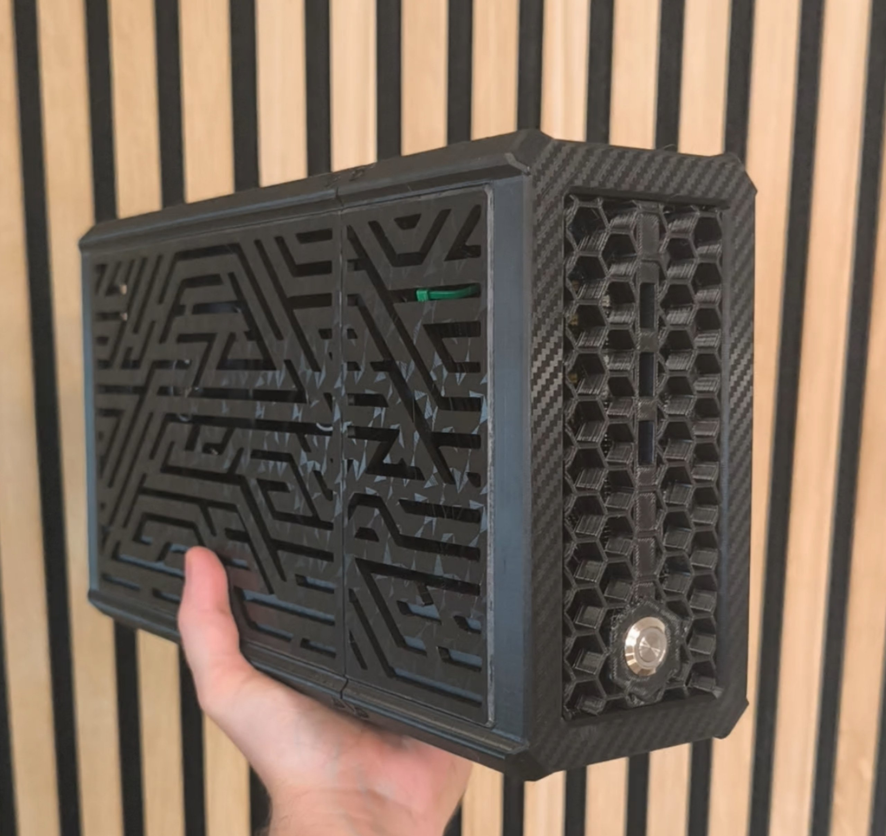

# lethe-bc250

<p align="center">
  
</p>

An **AMD BC-250** mining board turned into a small living-room console running **Bazzite**: tuned
from the Steam menu, with a sleep that actually works, a real power button you can also press from
your phone, and a printed case. Everything here is what one build uses every day, and a second one
was built from these instructions alone.

**Full documentation: <https://lethevimlet.github.io/lethe-bc250/>**

## What you get

* **Tuning without a custom BIOS.** `bc250-tune` and its Decky plugin switch the VRAM split, GPU clock
  range, 24 to 40 compute units, the 8-core unlock (with an automatic warm reboot so it survives a
  power-off), a software fan curve, a one-line HUD and the output resolution, all from Gaming Mode. 
  [Tuning](https://lethevimlet.github.io/lethe-bc250/tuning.html)
* **A sleep that works.** The board cannot suspend, so the BC-250 Sleep plugin freezes the game, mutes
  audio, turns the TV off and quiets the fans; any controller button brings it back where you left
  off. It takes over Steam's own Sleep entry. [Fake sleep](https://lethevimlet.github.io/lethe-bc250/sleep.html)
* **A real power button, and a phone page.** An ESP32 behind an optocoupler gives the board a proper
  front button and a web page with Power on, Shut down, Sleep and Force off, live stats (FPS, clocks,
  temperatures, watts, fan) and every tuning switch.
  [Soft power control](https://lethevimlet.github.io/lethe-bc250/power.html)
* <a id="46-stats-and-switches-over-the-network-bc250-api"></a>**Stats and switches over the LAN.**
  `bc250-api` is a tiny REST service on the console that feeds that page, and anything else you point
  at it. [bc250-api](https://lethevimlet.github.io/lethe-bc250/api.html)
* **A printed case** sized for two 120 mm fans. [Case](https://lethevimlet.github.io/lethe-bc250/case.html)

<p align="center">
  
</p>

## Quick start

On the BC-250, once Bazzite is installed, paste this and tick what you want. Run the same line on a
laptop to build and flash the ESP32 firmware instead.

```bash
curl -fsSL https://raw.githubusercontent.com/lethevimlet/lethe-bc250/main/install.sh | bash
```

The whole build, in order:

1. **[Parts](https://lethevimlet.github.io/lethe-bc250/parts.html)**: the board, the EPS12V power cable (not optional), two PWM fans, an ESP32-C3 and a PC817.
2. **[Hardware preparation](https://lethevimlet.github.io/lethe-bc250/hardware.html)**: heatsink lid off, fresh paste and pads, power cable, auto power-on jumper.
3. **[Install Bazzite](https://lethevimlet.github.io/lethe-bc250/os.html)**: BIOS settings first (IOMMU off, fan mode not Full Speed), then the 62fixolab patched image.
4. **[Tuning](https://lethevimlet.github.io/lethe-bc250/tuning.html)**: run the installer above.
5. **[Power button](https://lethevimlet.github.io/lethe-bc250/power.html)**: wire the ESP32 and the optocoupler, flash it, test step by step.
6. **[Case](https://lethevimlet.github.io/lethe-bc250/case.html)**: print, fit the fans, assemble.

## Read these first

* **The power cable is a fire-safety item.** The board peaks at 200 to 250 W on 12 V. Feed both of its
  power inputs from an EPS12V cable, never from a single PCIe 8-pin lead.
* **Do not use the system's real Sleep.** The board hangs and needs a power cut. With the Sleep plugin
  installed, Steam's Sleep entry runs the fake sleep instead.
* **The unlocks are a silicon lottery.** 40 compute units and 8 cores re-enable hardware AMD switched
  off. Turn on one at a time and step down if a game misbehaves.
* **Something odd?** [Things we learned](https://lethevimlet.github.io/lethe-bc250/lessons.html) and the
  [troubleshooting table](https://lethevimlet.github.io/lethe-bc250/power-page.html#if-something-misbehaves)
  cover what bit us, including the fan reading `n/a` after wiring the ESP32.

## What is in the repo

| Path | What |
|------|------|
| [`install.sh`](install.sh) | the guided installer behind the one-liner |
| [`decky-bc250-tune/`](decky-bc250-tune/) | `bc250-tune`, its boot service and fan daemon, and the Tune plugin |
| [`decky-bc250-sleep/`](decky-bc250-sleep/) | the Sleep plugin |
| [`bc250-api/`](bc250-api/) | the REST service and the console panel it serves to the ESP32 page |
| [`esp32-power-control/`](esp32-power-control/) | the ESP32 firmware and `flash.sh` (USB and over-the-air) |
| [`printed-case/`](printed-case/) | the STL files |
| [`docs/`](docs/) | the documentation site's sources |

Each folder has its own README with the details of that piece.

## Credits and license

This build stands on the work of the BC-250 community: the 62fixolab Bazzite images, the governor, the
CU live manager, the core unlock research, `bc250memcfg` and the case design. Names and links are on
the [credits page](https://lethevimlet.github.io/lethe-bc250/credits.html). MIT licensed, see
[LICENSE](LICENSE).
