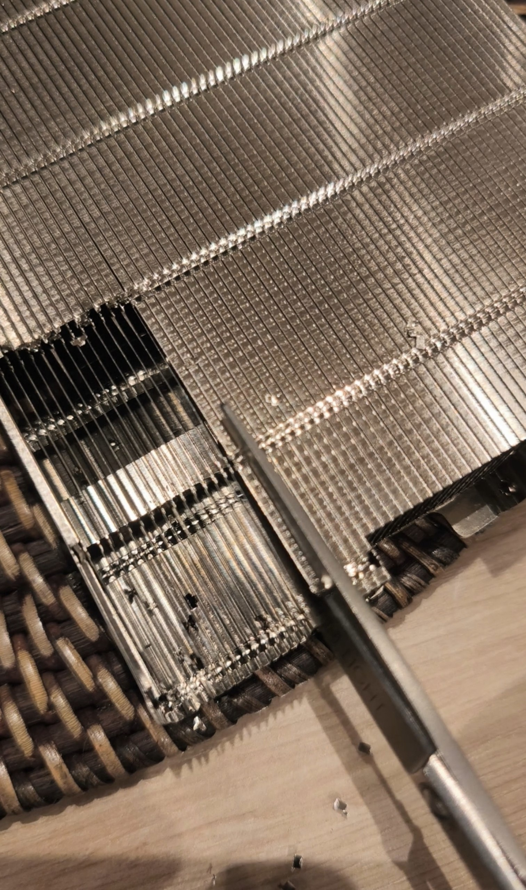

# Hardware preparation

## Remove the heatsink lid

The stock BC-250 cooler is a tall fin stack with a thin metal lid folded over the top of the fins.
It was made for the mining chassis, where fans push air front-to-back through the fins like a duct.
In the printed case the 120 mm fans sit on the shroud and blow onto the fins, and the lid is in the
way, so it comes off.

  

* Work with the heatsink off the board so you are not pressing on the APU.
* Use **thin, sharp scissors**. Cut the lid along the fin tops a few fins at a time, then peel the
  strip away, as in the photo. It is only crimped over the fins; there is no adhesive.
* **Protect your thumb.** The lid is thin sheet metal and the scissor handle bites into the thumb
  over a few hundred fins; without a glove or a piece of tape over the thumb it will go numb for days.
  The cut edges are sharp too.
* Go slowly. The fins bend easily; straighten any you fold with a flat blade afterwards.
* Shake and blow out the swarf before refitting the heatsink.
* **Renew the thermal interface while the heatsink is off.** The factory paste on the APU and the pads
  on the GDDR6 and VRMs are dry after years in a mining rack. Clean the APU and heatsink with
  isopropyl alcohol, apply new paste, and replace every pad with new **2 mm** pads (measure the old
  ones to confirm they match before you buy; do not reuse them).
* **Paste: Thermalright TFX, applied generously.** There is about a **1 mm gap** between the APU die
  and the heatsink base, far more than a normal CPU mount, so a thin rice-grain layer would not bridge
  it and the die would run hot. Spread a thick, full-coverage layer; a high-viscosity paste like TFX
  holds that thickness without pumping out. Do not rely on the pads to set the gap.

## Fit the power cable and the auto power-on jumper

While the board is out, set the **AUTO_PWRON1** jumper to pins 1–2 (auto power-on) so the board boots
whenever the PSU comes up; see [Before the OS](os.md#before-the-os).

{: .caution }
> **Fire hazard. Use the EPS12V → 2× Micro-Fit cable from [Parts](parts.md); this is not optional.**
> The BC-250 has two Micro-Fit 8-pin power inputs. Feeding the board through a single PCIe 8-pin plug
> puts its entire draw through one set of 18 AWG wires. With the tuning in [Tuning: bc250-tune](tuning.md) enabled (40 CU, 8 cores,
> higher GPU clock) that draw peaks at **200–250 W**, beyond what 18 AWG is rated for, and the wire and
> connector heat up. The EPS12V (CPU) 8-pin has four 12 V conductors rated for it; the adapter splits
> them across both board inputs. Never run the board on a PCIe cable alone, and never enable the
> unlocks on one.

Fitting it: the plugs' retention tabs foul the board, so **cut the tabs off** the two Micro-Fit
plugs before they will seat. Orientation as in the photo, both plugs side by side on the board's edge
connectors with the wires leaving upward.

  

---
