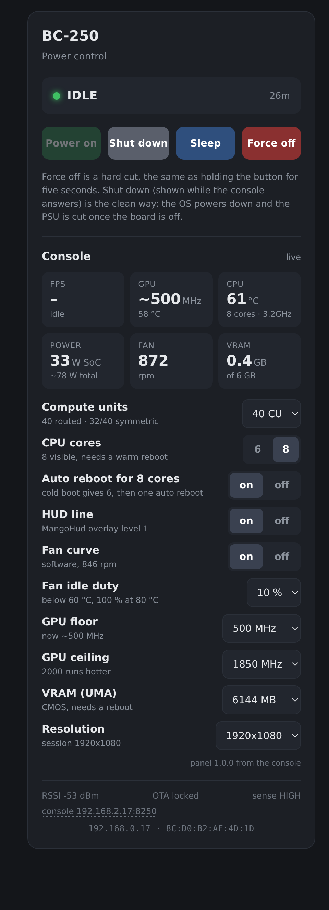
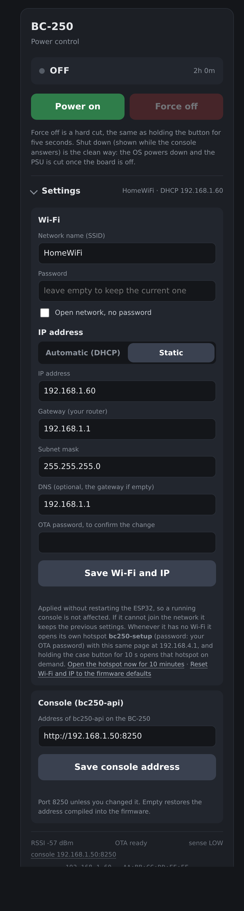

# Behaviour, web page, troubleshooting
## The button

| Press | Console off | Console running |
|-------|-------------|-----------------|
| **1 click** | powers on | **sleep**, or wake if asleep (through `bc250-api`) |
| **2 clicks** | powers on | **clean shutdown** (through `bc250-api`; the ESP32 cuts the PSU once the board is down) |
| **hold 5 s** | powers on | **force off**: hard cut of the PSU, only when nothing else works |
| **hold 10 s** | powers on, then opens the `BC250-AP` hotspot | forces off at 5 s, then opens the hotspot |

A click is a press shorter than five seconds; two clicks are two presses within half a second. The
click and double-click actions need `bc250-api` on the console: without it, or with the console
unreachable on the network, they do nothing (the footer's `click` field in `/rest/status` says why), and
only the 5 s hold is left. The Sleep plugin must be installed for sleep; a shutdown is the same clean
`systemctl poweroff` as the page's **Shut down** button. Sleep and hibernation do not work on the BC-250
([Things we learned](lessons.md)), so a sleeping board keeps the PSU on: that is what the fake sleep is for.

## Behaviour and the web page

  

The page at `http://<esp32-ip>` (the IP the router reserves for the ESP32; `http://bc250.local` also
works where the network resolves mDNS) is served by the ESP32 itself, with no
internet dependency. It shows the state (`OFF`, `STARTING`, `RUNNING`, `STOPPING`) with the ESP32's
uptime, a **Power on** button that is enabled only when off, and a **Force off** button that is enabled
only when running. The footer shows the Wi-Fi signal, whether OTA is armed (`OTA ready` only while
off), the sense line (`HIGH` while the BC-250 reports alive), and the IP and MAC, the latter for the
router's DHCP reservation. It polls `/rest/status` every two seconds while the tab is visible.

While the state is `RUNNING` the page grows a **Console** panel, fetched by the phone's browser
straight from `bc250-api` on the BC-250 ([Stats and switches over the network](api.md)) every five seconds; the ESP32 only hands the browser
the address (`console` in `/rest/status`, from `CONSOLE_API` in the sketch). Once the console
answers, the status line refines the ESP32's `RUNNING` into **RUNNING** (a game is running),
**IDLE** (on, no game) or **SLEEP** (the fake sleep of [Fake sleep](sleep.md) holds it, blue dot), and the button row
grows to **Power on · Shut down · Sleep · Force off**: Shut down is a clean `systemctl poweroff`
through `bc250-api` (the ESP32 cuts the PSU once the board reports down), Sleep / Wake drives the
fake sleep. Everything below the **Console** header (the tiles, the pending notice, the switches)
is `panel.js`, served by `bc250-api` and loaded by the page once the API answers, so that part
updates with the console and never needs a reflash; the firmware keeps only the state row, the four
buttons, the address editor and the offline notice. Tiles show FPS and the
running game, GPU clock and temperature, CPU temperature with cores and clock, SoC and estimated
total power, fan rpm and VRAM use. Below them are the `bc250-tune` switches (compute units, cores,
HUD, GPU floor and ceiling, VRAM split, resolution): a tap runs `bc250-tune set` on the console, and
when a change still needs a warm reboot or a session restart a notice appears with the button for
it. The tiles and switches only appear once `bc250-api` answers; until then (the OS still booting,
or the service not installed) the panel shows a short notice with **retry** and **change address**
links and a pointer to [Stats and switches over the network](api.md), and it says `asleep` during a fake sleep.
The footer's `console …` entry shows the `bc250-api` address; tapping it opens **Settings**.

## Settings: Wi-Fi, IP address, console address, login

  

Everything that used to need a reflash lives in one collapsible **Settings** section at the bottom of
the page. The values compiled into the sketch are only the first-boot defaults; what you save here is
kept in the ESP32's flash and wins over them.

* **Wi-Fi**: network name and password (leave the password empty to keep the current one, or tick
  *open network*).
* **IP address**: *Automatic (DHCP)* or *Static* with address, gateway, subnet mask and optional DNS.
  The static fields come pre-filled with what DHCP currently gives, so switching to static keeps the
  same address unless you change it.
* **Console (bc250-api)**: the address the page polls for stats and switches, in its own box with
  its own save button. No password needed for this one.

None of the saves asks for a password: on your own network the page is yours, and with the login
(below) on, being logged in is the protection. The one exception is changing the OTA password itself.
The read endpoint never returns the Wi-Fi password.

**A change cannot cut a running console.** It is applied without restarting the ESP32, so the PSU
stays latched. It is also only made permanent once it has proven itself:

1. New credentials get three join attempts within 25 seconds. If the ESP32 cannot join, it restarts
   its radio, returns to the previous settings and the page says why (*could not join that network,
   name or password wrong?*). On the test bench a wrong password cost eleven seconds.
2. If it joins but nothing reaches it within two minutes (a wrong static IP), it returns to the
   previous settings too. Reaching it, on the old address or the new one, is what saves the change;
   the page polls the new static address for you and moves there.
3. A power loss in between boots the previous, known-good settings.

**Hotspot fallback.** If the ESP32 cannot join Wi-Fi after being powered up (three failed joins or
30 seconds), it opens its own WPA2 network **`BC250-AP`** (password: your OTA password) for five
minutes and serves the same page at `http://192.168.4.1`, power buttons included. So a console that
moved house, or a router that changed its password, needs no reflash: power it up, join the hotspot,
fix the Wi-Fi under Settings, or simply use the buttons. That automatic opening happens once per
power-up. Wi-Fi that drops later is only retried, quietly; to get the hotspot then, **hold the case
button for ten seconds** (five minutes, at any time; this is also the way back in when the ESP32
joined a network but cannot be reached on it), use *Open the hotspot* in Settings, or power-cycle the
ESP32. Mind that the button hold first does what a press does: it starts the console from off, and
forces it off after five seconds when running. While the hotspot is up the ESP32 retries Wi-Fi only
once a minute and not at all while a phone is connected, and it closes the hotspot a minute after
Wi-Fi is back.

**The hotspot is budgeted, because it runs hot.** An access point cannot use modem sleep: the
receiver is on all the time. Measured on the board, the chip sensor reads about 45 °C in normal Wi-Fi
mode and 61 °C within ninety seconds of hotspot. Minimum transmit power, beacons four times sparser
and a single allowed client bought one or two degrees, no more: the always-on receiver is the cost,
and no setting keeps an active hotspot in the 40s. The same log shows the reading back at 46 °C
within thirty seconds of closing, so what matters for the hardware is the long-run average, and that
is what the firmware limits: the hotspot opens by itself only once, for five minutes after a power-up
without Wi-Fi, otherwise only on demand for five minutes, and never longer than fifteen with a phone
attached. One board that was left overnight with wrong Wi-Fi data, on the first firmware
without this budget, sat in hotspot mode all night and died. On top of the budget, the driver's own
non-stop reconnect scanning is switched off after twenty seconds without a join in favour of paced
retries, and above 70 °C on the chip sensor the hotspot closes at once and will not open even on
demand. *Open the hotspot* in Settings becomes *Close the hotspot* while it is up. The footer shows
the chip temperature. *Open the hotspot
now* in Settings, or **holding the case button for ten seconds**, opens it on demand for five minutes;
the button route is the way back in when the ESP32 joined a network but cannot be reached on it.
Mind that the same hold first does what a press does: it starts the console from off, and forces it
off after five seconds when running.

As a last resort, if Wi-Fi stays down for an hour **while the console is off**, the ESP32 restarts
itself to come back with a fresh radio; that restart does not count as a power-up, so it opens no
hotspot. It never restarts while the console runs.

**Access: a login for the page.** Off by default, so at home nothing asks. The **Access** block under
Settings turns it on with a username and a password (8 to 63 characters); once on, being logged in is
what it takes to change them or to turn it off again. With the login on, the page and every `/rest/…`
call (status, the power buttons, the settings) ask for it; the browser shows its own login box, and
the footer says `login on`. Five wrong passwords from one address block that address for a minute,
and only that one: a guesser on the internet cannot lock you out, and through a port forward the
address seen is the guesser's own. (A router that masquerades forwarded traffic shows everyone
outside as the gateway; that address is never blocked, so nobody is shut out, and the password's
strength is the protection there.) A forgotten
password is undone from your own network with the OTA password:
`curl -X POST http://<esp32-ip>/rest/auth -d on=0 -d ota=<OTA password>`.

**OTA password.** The password `flash.sh ota` uses for updates over the air, the password of the
`BC250-AP` hotspot, and the way back from a forgotten login. It starts as the one compiled into the
firmware and can be changed from the **OTA password** box under Settings, which is the one save that
asks for the current one. From then on it lives in the ESP32's flash; put the new one into
`config.local` on the PC you update from, or the next `flash.sh ota` is refused. With the login on,
`flash.sh ota` also needs `WEB_LOGIN=user:pass` in `config.local` to read the ESP32's state before
the update. If the OTA password is lost, only a
USB flash with `flash.sh usb --erase` (which also wipes the Wi-Fi, IP, console address and login set
from the page) puts the compiled one back.

{: .warning }
> This is what lets you forward the page's port (80) through your router so the console can be
> powered from anywhere, and it is a lock, not a vault. The login is HTTP digest: the password itself
> never travels, but nothing else is encrypted, since the ESP32 does no HTTPS: what the page shows
> (state, addresses, the console's stats) is readable on the way, and a forwarded port is a target
> for guessing, which the per-address block only slows. A VPN into your home (WireGuard on the router,
> Tailscale) is the better way to reach it, with no login needed. If you forward anyway: only port
> 80 of the ESP32, never 8250 (`bc250-api` has no login and takes tune settings and shutdowns), never
> 3232 (OTA), and never the console itself. The console panel on the page will not load from
> outside, since it comes from `bc250-api` on the LAN: the power buttons and Settings still work.

| Endpoint | What |
|----------|------|
| `GET /rest/net` | current and saved network settings, without the password; `last_error` after a rollback |
| `POST /rest/net` | `ssid`, `pass`, `open`, `mode=dhcp\|static`, `ip`, `gw`, `mask`, `dns`; `reset=1` returns to the compiled defaults |
| `POST /rest/hotspot` | opens the hotspot for five minutes (`secs=30…300`), `off=1` closes it |
| `GET /rest/console?url=…` | the `bc250-api` address; empty restores the compiled default |
| `GET /rest/auth` | whether the login is on, and the username |
| `POST /rest/auth` | `on=0\|1`, `user`, `pass` (empty keeps the current one); `ota` gets past a forgotten login |
| `POST /rest/otapass` | `cur`, `pass`: changes the OTA password (also the hotspot's) |

* The button does what [the table at the top](#the-button) says: a click powers on, or sleeps and
  wakes a running console; two clicks shut it down cleanly; a 5 s hold forces the PSU off (this only
  arms once the firmware has reached RUNNING, which needs the sense line connected); a 10 s hold opens
  the `BC250-AP` hotspot for five minutes (see Hotspot fallback above), after doing the other things on
  its way.
* The web page and `/rest/on`, `/rest/off`, `/rest/status` do the same over the network. A web off is
  a hard cut. `/rest/status` also carries `console`, the `bc250-api` address the page polls;
  `/rest/console?url=…` changes it without a reflash, and `/rest/net` does the same for Wi-Fi and IP
  (see Settings above). For bench checks without a serial cable it also has `temp` (chip, °C), `btn` and
  `presses` (the button, on pad `7` or `10`), `lows` (other free pads pulled to ground since boot),
  `pins` (the live level of every pad) and `auth` (whether the login is on).
* After a mains outage the machine stays off and waits for a press. To change that, call `psuOn()` at
  the end of `setup()` instead of entering `ST_OFF`.
* An ESP32 crash or watchdog reset cuts a running machine: the LED goes dark before any code runs.
  The circuit always fails off rather than on. Treat the ESP32 as part of the power path and do not
  reflash it while the BC-250 is up; OTA is gated on the OFF state for exactly this reason.

## If something misbehaves

| Symptom | Cause |
|---------|-------|
| PSU clicks on then straight off | `BOOT_BLANKING` too short, or the sense wire is miswired |
| PSU never starts | PC817 pins 1 and 2 swapped; the LED only conducts one way |
| PSU starts on its own | Pins 3 and 4 swapped, or the emitter tied to the logic ground node instead of pin 17 |
| ESP32 won't boot with sense connected | Sense on a strapping pin; keep it on GPIO 6 |
| Stays on after shutdown | TPMS1 pin 9 not actually dropping; remeasure |
| The case button does nothing, the web page's Power on works | Watch the page footer while pressing: it shows `button up ×N` and counts every press the ESP32 sees. If the count does not move, the button is not reaching pad `7` and ground (wrong pad, the mirrored underside labels, or a broken return to the star node). If the wiring checks out, measure pad `7` against the USB-C shell with the ESP32 powered: it must read 3.3 V at rest. 0 V there, with nothing connected that could pull it down, is a pad that never reached the chip (seen on one SuperMini): move the button wire to pad `10`, which the firmware reads as well. The footer also lists `pads seen low`, any other free pad that was pulled to ground since boot, which finds a wire on the wrong pad. If it counts but nothing starts, the state is not `OFF`: a press only starts the console from `OFF` |
| HUD shows `FAN n/a`, BIOS hardware monitor shows 65535 rpm, no fan curve | The sense wire sits on, or touches, an LPC signal pin of TPMS1 and knocks the Super I/O off the bus. Unplug it from TPMS1 and the reading comes back; then seat it on the real 3.3 V pin, clear of its neighbours (build step 8) |
| Shuts down during a warm reboot | Raise `SENSE_LOW_HOLD` above your reboot time |
| Cuts power ~25 s after every boot | R2 too large, or the sense pin is short of margin |
| Serial monitor stays blank | USB CDC On Boot not enabled, or not recompiled after changing it |
