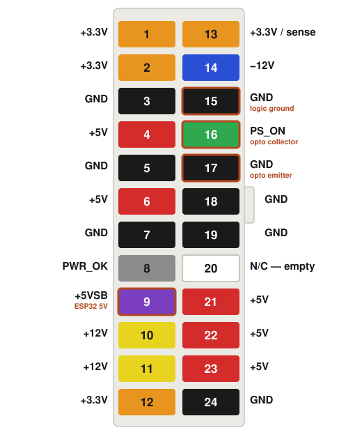

# Wiring and build order
## ATX 24-pin pins used

  

Contact face, retention tab on the right. The empty pin 20 and the tab between 18 and 19 fix the
orientation. Four pins are tapped:

| Pin | Signal | Used for |
|-----|--------|----------|
| 9 | +5VSB | ESP32 5V (live in standby) |
| 15 | GND | logic ground |
| 16 | PS_ON | optocoupler collector |
| 17 | GND | optocoupler emitter |

Pin 4 is not a substitute for pin 9: it carries +5 V only once the PSU has started, so an ESP32 fed
from it could never switch the PSU on. Only pin 9 is live in standby.

**How the taps are made in this build.** No connector was cut. Each of the four leads ends in a female
Molex-style crimp terminal, the same type that sits inside the 24-pin housing, crimped (or soldered) to
the wire. The terminal is pushed over the corresponding pin at the back of the PSU's 24-pin plug, where
the pins protrude from the wire-entry face, and a blob of **hot glue** holds it there and keeps it from
touching its neighbours. Check with the meter that each tap reads the expected rail and that none
bridges an adjacent pin before plugging the connector into the board. Hot glue peels off cleanly if you
ever need to undo it.

## Connections

| From | To | Via |
|------|----|-----|
| ATX pin 9 · +5VSB | ESP32 5V | — |
| ATX pin 15 · GND | Logic ground node | — |
| ESP32 GPIO 4 | PC817 pin 1 · anode | R3, 220 Ω |
| PC817 pin 2 · cathode | Logic ground node | — |
| PC817 pin 4 · collector | ATX pin 16 · PS_ON | — |
| PC817 pin 3 · emitter | ATX pin 17 · GND | — |
| BC-250 TPMS1 pin 9 | ESP32 GPIO 6 | R2, 1 kΩ |
| ESP32 GPIO 7 | Logic ground node | Push button |

The logic ground node is a star: the ESP32 GND pad, the button return and PC817 pin 2 meet at one
joint, and a single wire runs from that joint to ATX pin 15. The power cable to the BC-250 is not
touched.

**Finding the pads on the SuperMini.** Hold the board with the components facing you and the USB-C
connector up. The right edge then reads, top to bottom, `5V`, `G`, `3.3`, `4`, `3`, `2`, `1`, `0`,
and the left edge `5`, `6`, `7`, `8`, `9`, `10`, `20`, `21`. So power (`5V`) and ground (`G`) are the
two pads nearest the USB connector on the right, `4` is the fourth pad down on the right, and `6`
and `7` are the second and third down on the left. The pad names are printed on the underside,
where the two columns appear mirrored; go by the printed name next to the pad, not by position
alone. The schematic above shows the board from the component side.

In the schematic, GPIO 4 high lights the LED, the phototransistor conducts, PS_ON is pulled to ground
and the PSU starts. Nothing crosses the dashed isolation barrier except light. Pins 15 and 17 are both ground and join
inside the PSU; run two wires so they join there, through the supply's own heavy conductors, and not
through your thin wires. Bridging PC817 pin 2 to pin 3 works electrically and throws that away.

## Identifying the PC817

The dot marks pin 1. Pin 2 sits below it on the same side; pin 3 faces pin 2 across the body, and
pin 4 faces pin 1. The schematic draws the part that way, as the package seen from the top: LED on
the dot side (1 anode, 2 cathode), phototransistor on the other (4 collector, 3 emitter). The
collector goes to PS_ON and the emitter to ground; diagrams that draw the transistor *symbol* rather
than the package put the emitter at the bottom, which is the same pin 3. Confirm with a meter in diode mode before soldering:

* One pair reads roughly 1000–1200 mV one way and open the other. That pair is the LED; the pin where
  the red probe sits for the conducting direction is pin 1.
* The remaining pair reads open both ways, in both directions. No body diode is exactly the property
  that makes this part the right choice for switching PS_ON.

## The two capsules

There is no circuit board. Both small assemblies live inside heatshrink along the wiring, and everything
else is bare wire soldered to the ESP32's castellated pads.

* **Capsule 1**: the PC817 with R3 in series with pin 1. Four wires leave it: GPIO 4 in, ground out,
  PS_ON out, and the emitter ground out.
* **Capsule 2**: R2 inline, heatshrunk. Two wires out: one to TPMS1 pin 9, one to GPIO 6.

Slide the heatshrink onto the wire before soldering. Keep the leads short and use little solder: the
PC817's pins are close together and a generous joint bridges them easily.

## Build order

| # | Step |
|---|------|
| 1 | Unplug the PSU at the wall. Prepare the four taps for pins 9, 15, 16 and 17 (female Molex terminals + hot glue, see [ATX 24-pin pins used](power-wiring.md#atx-24-pin-pins-used)). |
| 2 | Build capsule 1. Verify the LED with the diode test above, and confirm pins 3 and 4 read open in both directions. |
| 3 | Wire pin 9 to the ESP32 5V pad and pin 15 to the logic ground node. Plug in the PSU and confirm the ESP32 comes up with the system off. Measure the 5V pad against the ESP32's own GND pad; the onboard LED alone proves nothing. |
| 4 | Flash the firmware ([Flashing the firmware with the Arduino IDE](power-firmware.md#flashing-the-firmware-with-the-arduino-ide)) with `BENCH_MODE 0`. The serial log should show the boot line and state OFF. |
| 5 | Connect pin 16 to the collector and pin 17 to the emitter. Attach the power cable to the BC-250 and set AUTO_PWRON1 to pins 1–2. Press the button; the PSU should start and the board boot. |
| 6 | With the system running, measure TPMS1 pin 9 against ground. It should read 3.3 V and drop to 0 V after shutdown. Only then wire R2 to GPIO 6. |
| 7 | With the system on, measure PS_ON to ground. It must sit below 0.8 V. |
| 8 | With R2 wired and the system running, confirm the fan speed still reads: a real rpm in the BIOS hardware monitor, or in Linux `sensors` / the HUD's `FAN`. **65535 rpm in the BIOS, or `FAN n/a`, means the sense wire is loading an LPC line** instead of sitting on the 3.3 V pin: the 3.3 V / 0 V check of step 6 cannot tell them apart, because the LPC data lines next to pin 9 are pulled up to 3.3 V too. Move the wire, make sure its connector touches no neighbouring pin, and check again. |
