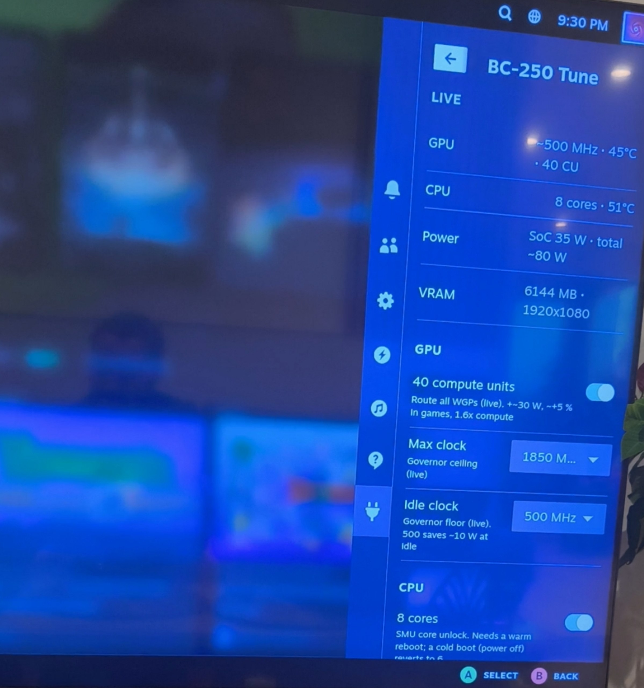

# Tuning: bc250-tune
All the tuning lives in one script, [`decky-bc250-tune/bc250-tune`](https://github.com/lethevimlet/lethe-bc250/tree/main/decky-bc250-tune/bc250-tune), with a
**Decky Loader plugin** ([`decky-bc250-tune/decky-plugin/`](https://github.com/lethevimlet/lethe-bc250/tree/main/decky-bc250-tune/decky-plugin/)) that puts the same
switches into Steam's Quick Access menu (the `…` button) so nothing needs Desktop Mode. The folder has
its own [README](https://github.com/lethevimlet/lethe-bc250/tree/main/decky-bc250-tune/README.md) with every option; this is the summary.

<p align="center">
  
</p>

Photographed on the TV with 40 CU and 8 cores switched on: the GPU clock shows `~500 MHz` (estimated
from voltage, see [What this build runs](tuning.md#what-this-build-runs)), 8 cores at 51 °C, 35 W package power, 6144 MB VRAM at 1920x1080.

{: .caution }
> `CU=40`, `CORES=8` and `GPU_MAX=2000` raise the board's draw to 200–250 W peaks. Only enable them
> with the EPS12V → 2× Micro-Fit power cable fitted ([Fit the power cable and the auto power-on jumper](hardware.md#fit-the-power-cable-and-the-auto-power-on-jumper)). On a single PCIe 8-pin cable this is a
> fire hazard.

{: .warning }
> **Silicon lottery.** The 40 CU and 8-core unlocks re-enable hardware that AMD disabled at the
> factory, and not every board has healthy spare units. Some BC-250s run all 40 CUs and 8 cores for
> years, others artifact, crash or fail to launch games at 40 CU, or hang after the core unlock. Nothing
> in this guide can predict which you have. Enable one unlock at a time, test with demanding games and a
> stress run while watching temperatures in the HUD, and only keep what stays stable. If 40 CUs
> misbehave, step down (`CU=36`, `32`, …) until it is stable rather than giving up on the unlock; the
> counts not divisible by 8 are asymmetric across the shader rows ([Tuning: bc250-tune](tuning.md) table), so prefer to end on 32. Both unlocks
> revert easily: `CU=24` is live, and a cold boot (power off) restores 6 cores.

| Switch | What it does | Applies |
|--------|--------------|---------|
| `UMA_SIZE` | VRAM / system-RAM split of the 16 GB, written to CMOS with [bc250memcfg](https://github.com/fanoush/bc250_memcfg) (built from source at install). Survives reinstalls; only a CMOS clear resets it. | next reboot |
| `GPU_MIN` / `GPU_MAX` | The governor's frequency range. 500 MHz floor saves ~10 W at idle; 1850 MHz is the image default ceiling. | live |
| `CU` 24 … 40 | Routes WGPs (two CUs each) through `bc250-cu-live-manager`, any even count from the stock 24 to all 40. Extra WGPs go on one shader row at a time, so 24, 32 and 40 are the symmetric, known-good steps; the counts in between leave the rows one WGP apart, which the dispatcher copes with but which is less efficient per WGP and far less tested. Use them as a ladder to find what a board tolerates, then settle on 32 or 40. At 40: compute ~1.6x, games only a few % (fill-rate bound), ~+30 W. | live, re-applied at boot |
| `CORES` 6 / 8 | Enables the two dormant cores with an SMU message (technique from [GabriWar/bc250-core-cu-unlock](https://github.com/GabriWar/bc250-core-cu-unlock)). Nothing is flashed. | warm reboot; a cold boot reverts |
| `CORES_AUTO_REBOOT` | The core mask does not survive a power-off, so a cold boot with `CORES=8` comes up with 6 cores until a warm reboot. `on` makes the boot service do that reboot itself, once (a persistent stamp rules out a loop). Adds ~40 s to a power-on, and every power-on then ends in a warm reboot: keep controller dongles on a board USB port ([Things we learned](lessons.md)). | next cold boot |
| `FAN_CURVE` | Software fan curve (`bc250-fan.service`): the header follows the hotter die, `FAN_MIN` % (10) up to `FAN_LOW_C` (60 °C), 100 % at `FAN_HIGH_C` (80 °C). The BIOS Standard curve sits at 50 % duty at idle, which is loud on 3000 rpm fans; this brings idle to ~600 rpm. 4-pin PWM fans, BIOS fan mode not Full Speed; guards fall back to the BIOS curve. | live |
| `HUD` | One-line MangoHud layout as Performance Overlay level 1 (files in [`decky-bc250-tune/mangohud/`](https://github.com/lethevimlet/lethe-bc250/tree/main/decky-bc250-tune/mangohud/)) | next game launch |
| `RES` | Gaming Mode output resolution (e.g. 1080p on a 4K panel) | gaming session restart |

## Install

The quick way is the guided installer from [Quick start](index.md#quick-start) (`curl … | bash` on the BC-250, tick what you want). By
hand:

On the BC-250, from a Desktop Mode terminal:

```bash
git clone https://github.com/lethevimlet/lethe-bc250.git
cd lethe-bc250/decky-bc250-tune
sudo ./bc250-tune install          # installs to /usr/local/bin, builds bc250memcfg, enables bc250-tune.service, applies defaults
sudo bc250-tune status
```

Decky plugin (optional, for the Quick Access menu; the frontend is prebuilt in `decky-plugin/dist/`):

```bash
ujust setup-decky install
sudo mkdir -p ~/homebrew/plugins/bc250-tune
sudo cp -r decky-plugin/{plugin.json,package.json,main.py,LICENSE,dist} ~/homebrew/plugins/bc250-tune/
sudo chown -R root:root ~/homebrew/plugins/bc250-tune
sudo systemctl restart plugin_loader      # then restart Steam / the gaming session
```

Open the Quick Access menu → Decky (plug icon) → **BC-250 Tune**. Set the Performance Overlay slider to
level 1 to get the HUD line.

Two Decky notes for Bazzite: the `ujust` installer leaves Decky's own binary readable by root only,
which breaks every plugin that does not run as root (the backend dies with `PermissionError:
…/homebrew/services/PluginLoader`); fix it once with
`sudo chmod a+rx ~/homebrew/services ~/homebrew/services/PluginLoader && sudo systemctl restart plugin_loader`.
And the store's **Pause Games** plugin (freeze and resume a running game with SIGSTOP/SIGCONT, like
the Steam Deck's quick suspend) works on the BC-250 once that is done; it is a nice companion since real
sleep is not available.

## What this build runs

| Setting | Value | Why |
|---------|-------|-----|
| VRAM split | 6144 MB VRAM / ~9.6 GB RAM | 1080p never needs 8 GB of VRAM; the RAM is more useful |
| GPU range | 500–1850 MHz | 1850 is the image default; 500 idle floor drops idle package power from ~41 W to ~32 W |
| Resolution | 1920x1080 | The GPU is roughly RX 6600 class; 4K is not realistic |
| CU / cores | toggled from the plugin as needed | 40 CU + 8 cores are worth ~5–12 % in games for ~50 W more; this particular board is stable with both, yours may not be |
| HUD | on, overlay level 1 | `· 60 FPS \| GPU 48°C 1300MHz  CPU 54°C  SoC 47W  TOTAL ~92W  FAN 1587  24CU 6C` |

The HUD's `SoC` is the measured APU package power; `TOTAL ~` adds ~45 W for the GDDR6, VRM losses,
fan and SSD because the board has no 12 V sensor. `24CU 6C` shows what is currently enabled. With
8 cores enabled the kernel's GPU clock readouts break, so the clock is estimated from the GFX voltage
and shown with a `~`.

## Commands

```bash
sudo bc250-tune menu                 # whiptail TUI
sudo bc250-tune set cu 40            # keys: uma gpu-min gpu-max cu cores hud res
sudo bc250-tune set cores 8          # then: sudo bc250-tune reboot   (warm)
sudo bc250-tune status --json
```

## The custom HUD line

One line, top of the screen, nothing else on it:

```
· 47 FPS | GPU 48°C 1300MHz  CPU 54°C  SoC 47W  TOTAL ~92W  FAN 1587  24CU 6C
```

| Field | Source | Meaning |
|-------|--------|---------|
| `47 FPS` | MangoHud | frame rate; the `·` replaces the engine name MangoHud would print |
| `GPU 48°C 1300MHz` | amdgpu edge temperature; governor clock | with 8 cores enabled the kernel clock readouts are garbage, so the clock is estimated from the GFX voltage and shown as `~1300MHz` |
| `CPU 54°C` | k10temp Tctl | CPU temperature |
| `SoC 47W` | amdgpu package power (PPT) | the real, measured number: CPU cores + GPU + memory controller |
| `TOTAL ~92W` | `SoC + 45 W` | estimate of what the power cable delivers; the board has no 12 V sensor. Offset is `TOTAL_OFFSET_W` in `/etc/bc250-tune/config` |
| `FAN 1587` | board fan header (nct6686) | fan speed, rpm (both fans on the Y-splitter report as one) |
| `24CU 6C` | `bc250-tune` state | compute units routed and CPU cores enabled |

Everything after the FPS comes from `bc250-tune hud-stats`, which MangoHud runs through its `exec=`
option. MangoHud's own `cpu_power` and `gpu_power` are not used: on the BC-250 the first does not
initialise and the second reports only the graphics block, not the package.

**Enabling it.** `bc250-tune` with `HUD=on` (the default) writes two files for the desktop user:

* `~/.config/MangoHud/presets.conf` — defines `[preset 1]`. In Gaming Mode Steam ignores
  `MangoHud.conf` and picks a preset from the **Performance Overlay Level** slider in the Quick Access
  menu (the `…` button → performance tab). **Level 1 is our line**; levels 2–4 stay MangoHud's built-ins.
  Read at game launch.
* `~/.config/MangoHud/MangoHud.conf` — the same line for Desktop Mode or games launched with
  `mangohud %command%`. Toggle with `Right Shift + F12`.

Both files are marked `# bc250-tune managed`; the script never overwrites an unmarked `MangoHud.conf`
of your own, and `HUD=off` removes only its own files. Reference copies are in
[`decky-bc250-tune/mangohud/`](https://github.com/lethevimlet/lethe-bc250/tree/main/decky-bc250-tune/mangohud/).

**Why the config looks odd.** With MangoHud 0.8 (`legacy_layout=0`) every option listed in the file
becomes a column with a `|` separator, even ones set to `0`, which is where stray empty bars come
from. So the preset lists only `fps` and `exec`, sets `fps_text=·` to drop the engine name, and puts
`frametime=0` last, where it hides the ms value without adding a column. One `|` between the FPS and
the rest is unavoidable. To change the line, edit the `printf` in `hud_stats()` in the script; to
preview layouts without a game, run `mangohud glxgears` under `Xvfb` and screenshot it.
